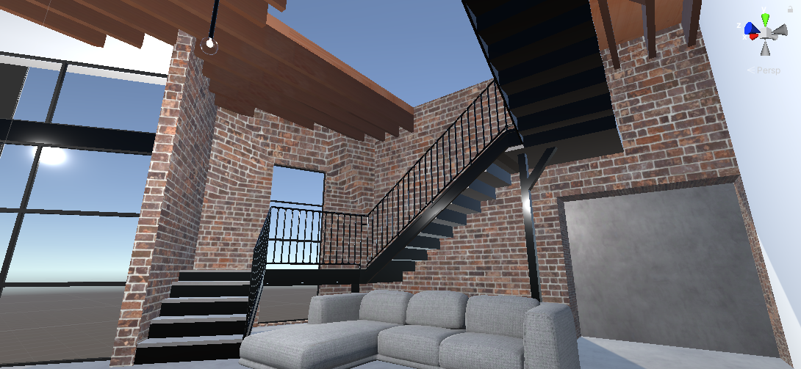
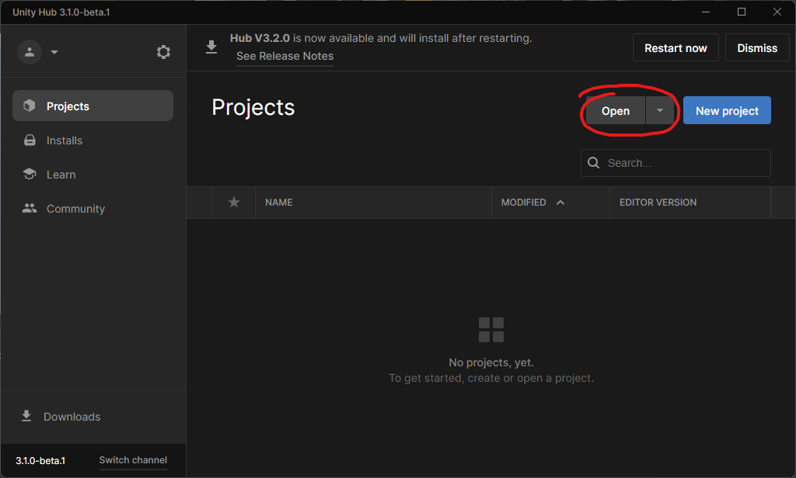
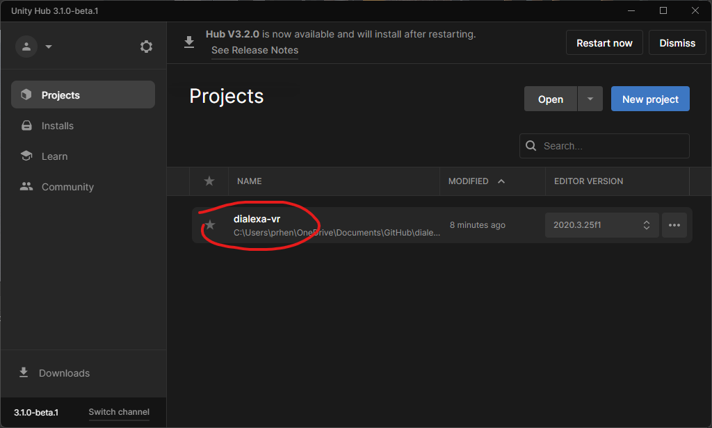

# Dialexa-VR

A virtual representation of the Great Hall at Dialexa HQ.

## First Time Install
1. Install Unity (we recommend using [Unity Hub](https://unity3d.com/get-unity/download))
1. Install [Blender](https://www.blender.org/download/)
1. Clone repo
1. Open Unity Hub, go to Projects and click Open. Browse to the project directory

1. When you click on the project, Unity Hub should recommend an appropriate Unity version to install. Install that.

1. Once your Unity version is installed, you should be able to open the project.

## Scenes within the project

Scenes can be found at `Assets/Scenes` within the Unity project hierarchy
- Dialexa - the default scene, open this scene if you are looking to run/work on the WebGL desktop experience currently deployed at [vr.dialexa.com](https://vr.dialexa.com)
- VR Great Hall - open this scene if you are looking to run/work on a local VR headset

